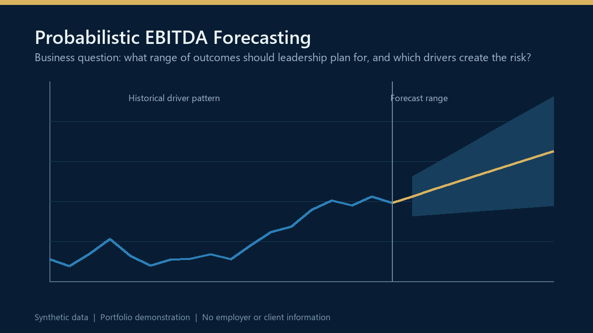

# Probabilistic EBITDA Forecasting

> Executive decision-support portfolio project using synthetic data.

## Business objective

Move planning conversations beyond a single-point EBITDA forecast. The framework shows leadership a range of plausible outcomes, identifies the drivers creating uncertainty, and supports contingency planning before risks materialize.

## Executive questions supported

- What outcome range should leadership plan around?
- Which price, volume, cost, and mix assumptions create the greatest risk?
- How should management distinguish a base case from an upside or downside scenario?
- Where should forecast governance and management attention be concentrated?

## Decision logic

The notebook models underlying business drivers, develops time-series forecasts, and uses Monte Carlo simulation to translate uncertainty into an interpretable outcome range. The design emphasizes driver relationships, scenario transparency, and decision usefulness rather than a false sense of precision.

## What the model produces

- Driver-based forecasts for price, volume, and cost inputs
- Probabilistic EBITDA ranges and confidence intervals
- Base, upside, and downside scenario views
- Visual separation of historical patterns and forward risk
- A management framework for challenging assumptions

## Governance and privacy

This is a portfolio demonstration built entirely with synthetic data. It contains no employer, client, product, customer, transaction, budget, or forecast information. Results are illustrative and are not claims of actual forecast performance.

## Run the notebook

1. Install the packages in `requirements.txt`.
2. Open `Probabilistic_EBITDA_Forecasting_Framework.ipynb`.
3. Run the notebook from top to bottom to reproduce the model and visuals.

## Technology and analytical methods

Python, pandas, NumPy, ARIMA, linear regression, Monte Carlo simulation, matplotlib, seaborn, Plotly, driver-based planning, scenario analysis.

---

Created by [Aftab Khan](https://www.linkedin.com/in/aftabparvezkhan/) as part of a finance, data, and AI decision-intelligence portfolio.
